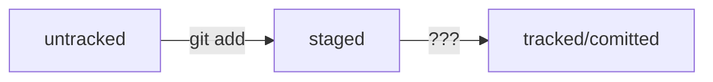

# Пояснения к проекту с обучения
---
Проект разрабатывается с целью изучения курса **_Network Engineer_** на платформе [ОТУС](https://www.otus.ru "Платформа обучения")

__Пробуем нарисовать схему в _MERMAID___
---

**Файл** создан в рамках методических материалов с целью освоения языка разметки **Markdown**